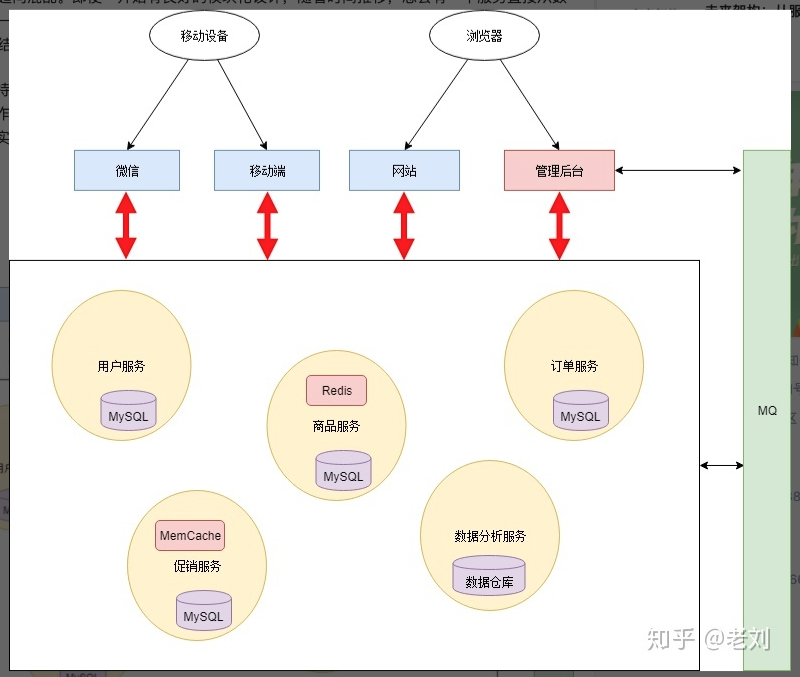

# Micro Service

Micro service is trying to divide a large service framework into smaller services. 

  
   
  
Fig 1: Service Framework
 

asdasd

---
asdasd

  
   
  
Fig 1: Micro Service Framework
 

## Reference
[The framework of micro services](https://www.zhihu.com/question/65502802)
[The connection among services](http://dockone.io/article/3687)

